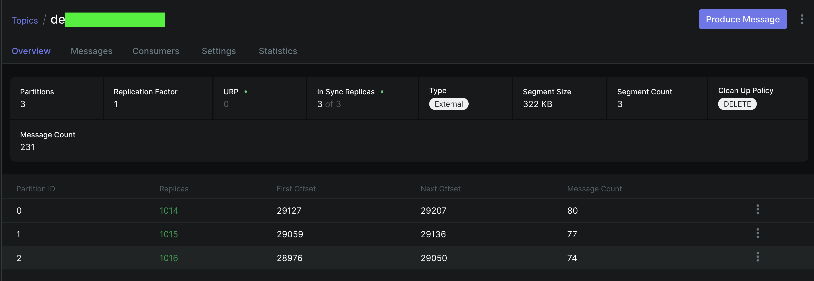
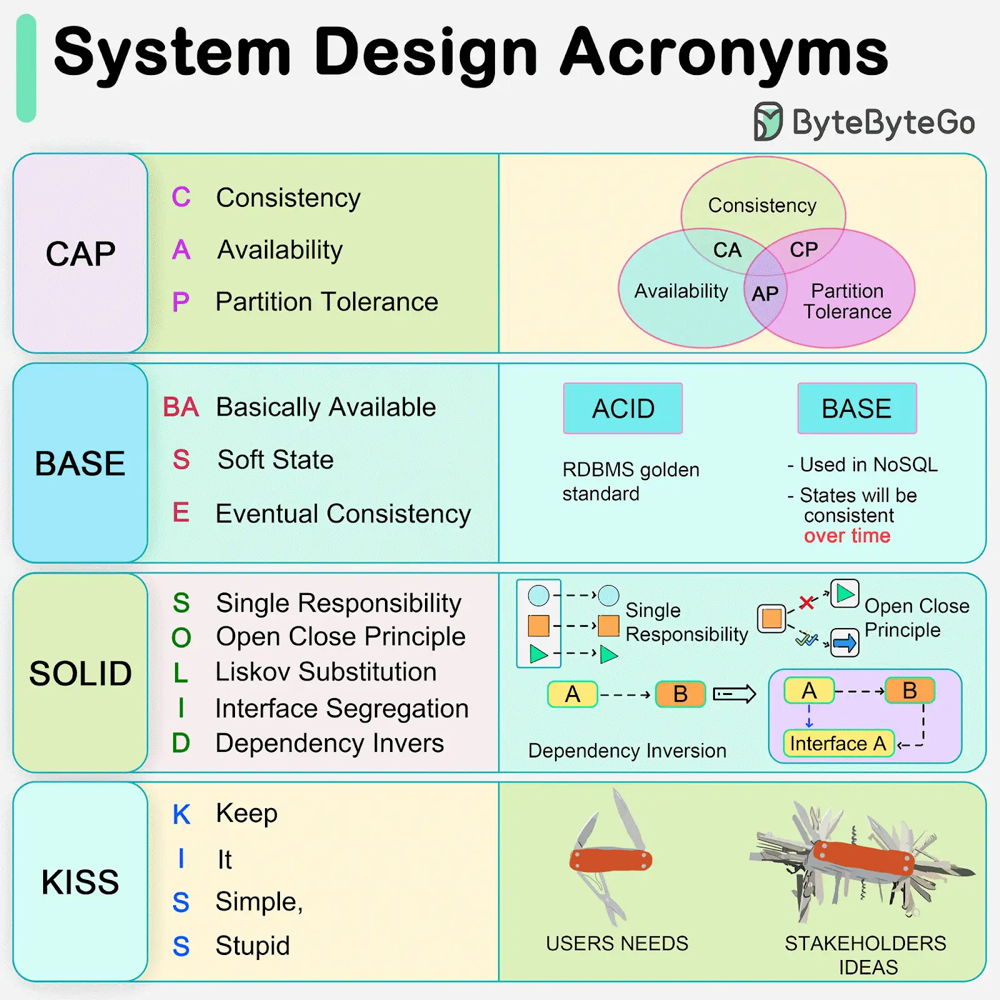

##
- 공부(깊이)
- 개발자 관점
- 운영자 관점

## Key Takeaways

## 1장
- 카프카의 등장 배경
- 카프카에서 데이터의 기본 단위는 `메시지`다.
- 카프카의 입장에서 메시지는 단순히 `바이트의 배열`
- 메시지는 키(key)

그림 1-5(여러 개의 파티션을 갖는 토픽)


- 카프카는 `CAP` 관점에서 살펴볼 필요가 있음. 도메인의 특성에 따라 조금씩 개발 및 운영방식이 달라짐
- 추후 배울 개념


## 2장
- https://brunch.co.kr/@peter5236/13


## 3장
- https://www.yuki-dev-blog.site/data-engineering/kafka/kafka-core-guide/3
- 해당 내용으로 갈음하겠습니다.

카프카 프로듀서(3장)
- Kafka 3.0 이후 버전에서는 acks=all을 설정하면 enable.idempotence=true가 자동 활성화됩니다.
- https://cwiki.apache.org/confluence/display/KAFKA/KIP-679%3A+Producer+will+enable+the+strongest+delivery+guarantee+by+default
```java
        // For idempotence producers, values for `retries` and `acks` and `max.in.flight.requests.per.connection` need validation
        if (idempotenceEnabled) {
            final int retries = this.getInt(RETRIES_CONFIG);
            if (retries == 0) {
                if (userConfiguredIdempotence) {
                    throw new ConfigException("Must set " + RETRIES_CONFIG + " to non-zero when using the idempotent producer.");
                }
                log.info("Idempotence will be disabled because {} is set to 0.", RETRIES_CONFIG);
                shouldDisableIdempotence = true;
            }

            final short acks = Short.parseShort(acksStr);
            if (acks != (short) -1) {
                if (userConfiguredIdempotence) {
                    throw new ConfigException("Must set " + ACKS_CONFIG + " to all in order to use the idempotent " +
                        "producer. Otherwise we cannot guarantee idempotence.");
                }
                log.info("Idempotence will be disabled because {} is set to {}, not set to 'all'.", ACKS_CONFIG, acks);
                shouldDisableIdempotence = true;
            }

            final int inFlightConnection = this.getInt(MAX_IN_FLIGHT_REQUESTS_PER_CONNECTION);
            if (MAX_IN_FLIGHT_REQUESTS_PER_CONNECTION_FOR_IDEMPOTENCE < inFlightConnection) {
                throw new ConfigException("To use the idempotent producer, " + MAX_IN_FLIGHT_REQUESTS_PER_CONNECTION +
                                          " must be set to at most 5. Current value is " + inFlightConnection + ".");
            }
        }

```

```markdown
🔹 Kafka Producer에서 Idempotence(멱등성)을 사용하려면?
1) retries > 0 → 재시도 가능해야 함.
2) acks = all → 모든 복제본이 메시지를 받을 때까지 기다려야 함.
3) max.in.flight.requests.per.connection ≤ 5 → 순서가 꼬이지 않도록 제한해야 함.

만약 이 조건이 만족되지 않으면:

- 사용자가 idempotenceEnabled = true로 설정했으면 → 예외 발생 (ConfigException 던짐).
- 사용자가 idempotenceEnabled를 명시적으로 설정하지 않았다면 → 자동으로 멱등성을 비활성화 (shouldDisableIdempotence = true).

```


### 심화 자료
- Kafka Producer 내부에서 RecordBatch가 ProducerBatch로 변경됨.
- Kafka 2.1.0 이후 버전에서는 RecordAccumulator가 Map<TopicPartition, Deque<ProducerBatch>>를 관리.

